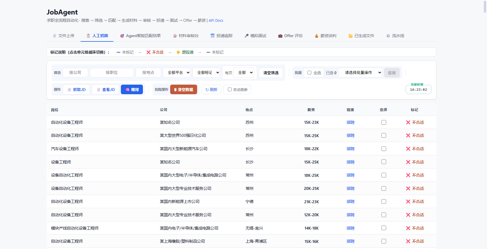
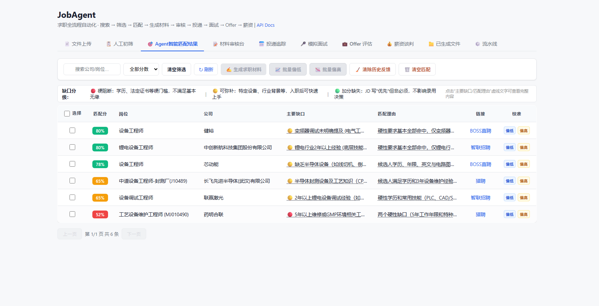

# Job Agent (求职 AI Agent)

[](https://github.com/yjxhn/job-agent/actions)


An intelligent job-hunting assistant: auto job search → human review → LLM ranking → resume tailoring → application tracking. Built for the Chinese job market (BOSS直聘, 猎聘, 智联招聘 + public APIs from Tencent / NetEase / BYD / NAURA / YOFCC).

> 中文文档见 [README.md](README.md)。

## Features

- **Multi-platform concurrent search** — 8 sources (boss_zhipin / liepin / zhilian via Playwright browser mode / tencent / netease / byd / naura / yofc), cross-platform dedup, HTTP API direct or headed-browser for anti-bot platforms
- **Human review** — mark 🌟 interested / ❌ reject in the web dashboard, then LLM deep-grades each interested job (score + gap analysis + reasoning, concurrency 5, JSON-forced with retry)
- **Resume tailoring** — one-click customized resume (.docx + .md) per job, auto-opens the job link
- **Application tracking** — 7-stage state machine (applied → HR read → interview scheduled → 1st round → 2nd round → offer → onboard, or terminated), timeline + manual logging of off-platform applications
- **Interview prep & mock interview** — predicted questions per job (technical / behavioral / project deep-dive / reverse questions), text mock interview with streaming SSE, plus realtime voice mock interview (Volcengine SC2.0)
- **Offer evaluation & salary negotiation** — 8-dimension offer scoring with radar chart, negotiation strategy (anchor / leverage / concessions / scripts)
- **Chat mode** — natural-language REPL (`job-agent chat`) driving 12 tools via LLM function-calling
- **Scheduler** — periodic search daemon with quiet hours and Windows toast notifications
- **Web Dashboard** — 10 tabs covering the entire flow at http://localhost:8765

## Dashboard Preview



*Review: mark 🌟 interested / ❌ reject across platforms*



*Match: LLM percentage score + key gaps + calibration feedback*

## Quick Start

```bash
pip install -e .
playwright install chromium   # only for zhilian browser mode
```

Set the DeepSeek API key:

```bash
# Windows
setx DEEPSEEK_API_KEY "sk-your-key"
# Linux/Mac
export DEEPSEEK_API_KEY="sk-your-key"
```

Config:

```bash
cp config.example.yaml config.yaml
cp .env.example .env
```

## Usage

```bash
job-agent check-cookies                        # health-check platform cookies
job-agent search --keyword Python              # search jobs across platforms
job-agent pipeline --stages search,filter,match --keyword Python
job-agent tailor <job-id>                      # generate tailored resume (.docx+.md)
job-agent track add <job-id>                   # log application
job-agent track update <app-id> --status 二面  # advance status
job-agent interview-prep <job-id>              # predict interview questions
job-agent mock-interview <job-id>              # text mock interview
job-agent offer-eval --company X --title Y --salary "20K-28K"
job-agent salary-advice --company X --salary 24K --target 30K
job-agent chat                                 # natural-language chat mode
job-agent serve                                # launch dashboard at http://localhost:8765
```

> Note: boss_zhipin / liepin require manually exported cookies (anti-bot CDP detection); see the Chinese README's "Cookie 获取流程" section.

## Testing

```bash
python -m pytest tests/ -q
```

1300+ tests, 84.4% coverage (pytest-cov fail_under=79 in CI, ruff + mypy + bandit).

## License

MIT
